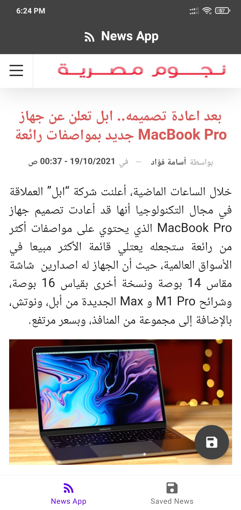

# News App 

 
## Requirements
*   splach screen.
*   get news from api
*   open news in webview
*   save news in room 
*   get all saved news from room 
*   unit test for room and api services

 ###### **Tecgnologes uses in it.**
 * Kotlin.
 * xml
 * MVVM Design Pattern
 * Hilt
 * Room Database
 * LiveData
 * Coroutines
 * Retrofit
 * okhttp3
 * navigation
 * mockwebserver for testing
 * truth for testing
 * yarolegovich recyclerView
 
 *  **[Api for simple json] (https://newsapi.org)**.

  ###### **Tools and IDEs uses.**
* Android Studio

*   **[Download latest debug APK here] (https://github.com/azmiradi/TestApp/blob/master/app-debug.apk)**.

| splach | main |
| --------------- | ---------------- | 
|  |  |

 
| news webview | saved news |
| --------------- | ---------------- | 
|  |  |

<!-- Redmi not 6 pro -->
